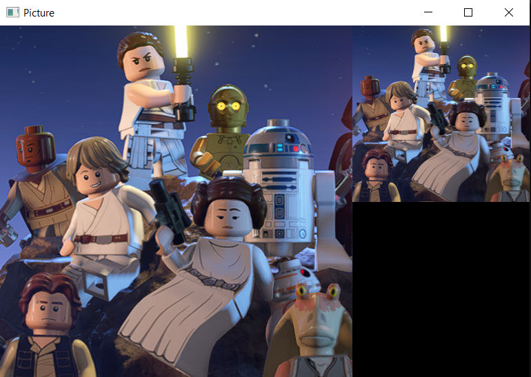

# Unity Based Data Generator

# 1. Responds to questions
### (1) Write a program that receives an NxN image (N is power of 2 for simplicity) and returns an image that is N/2 x N/2 with each pixel is an average of 4 adjacent pixels in the input image. (Use OpenGL API Texture to render the processed image and Render image using OpenGL texture)
- The program use `glTexParameteri` as the algorithm of resizing since `GL_LINEAR` will use the four nearest pixel to produce the result, which is the same as required. I also implement a resize shader. Using such shader will also perform the required task using GLSL, which is also paralleling the code. Both way will create slightly faster result than using CPU to compute.

### (2) How can you modify this program to do I for 10 or 100 images?
- Rather than initializing VAO and VBO the image inside main, I wrote a class for `picture`, which can reuse the code when producing a bunch of images 

### (3) Can you modify program using multiple threads to optimize for processing speed?
- The current method I use which is calling `glTexParameteri` will produce the result during fragment shader. And the `resizeShader` will also do such method during GPU rendering. 
- For CPU parallelism, I tried to run the code with either multithreading in C++ and also omp, both method will produce bad result since it mess up with VAO and VBO binding and OGL APIs which will lead to black images. 
- I also write a CPU code with omp that doesnt do rendering at all and it produce the same speed as my current method. So we can assume that our code is faster, since it also do the rendering procedure during the process of resizing the image. But the difference is not significant

# 2. How to use
1. Create an `Image` folder and a `Result` folder
2. Place all your NxN images inside `Image` folder, the program will read RGB and RGBA format images
3. Start the program
4. All resized images will be present inside `Result` folder, result image name will be `originalname_result.png`
5. Use left and right arrow key to switch between images, on left side is the original image and the right corner shows the result image. The showing picture's name will be printed in the terminal

  

## Pipline
1. Generate a `Picture` object for each image inside `Image`
2. Using `GL_LINEAR` to process texture
3. Render this `Picture` object once to the frame buffer
4. Store frame buffer
5. Write the buffer data into result image

# 3. Build Instruction
[Please refer to UC SanDiego CSE167 starter code build instruction](http://ivl.calit2.net/wiki/index.php/BasecodeCSE167F20)
# 4. Examples:
## Input image:

  

## Output image:

  

# 5. Reference
### C++
- [How to get file number in a directory(std::filesystem)](https://stackoverflow.com/questions/41304891/how-to-count-the-number-of-files-in-a-directory-using-standard)
- [omp](https://www.openmp.org/wp-content/uploads/OpenMP3.1-CCard.pdf)
- [stb](https://github.com/nothings/stb/tree/master)
## OpenGL
- [How GL_LINEAR perform](https://registry.khronos.org/OpenGL-Refpages/gl4/html/glTexParameter.xhtml)
- [Texture Mapping](https://learnopengl.com/Getting-started/Textures)
- [Save frame buffer into image](https://lencerf.github.io/post/2019-09-21-save-the-opengl-rendering-to-image-file/)
## Shader.cpp / Shader.h 
 - [UC SanDiego CSE167 starter code](http://ivl.calit2.net/wiki/index.php/BasecodeCSE167F20)

